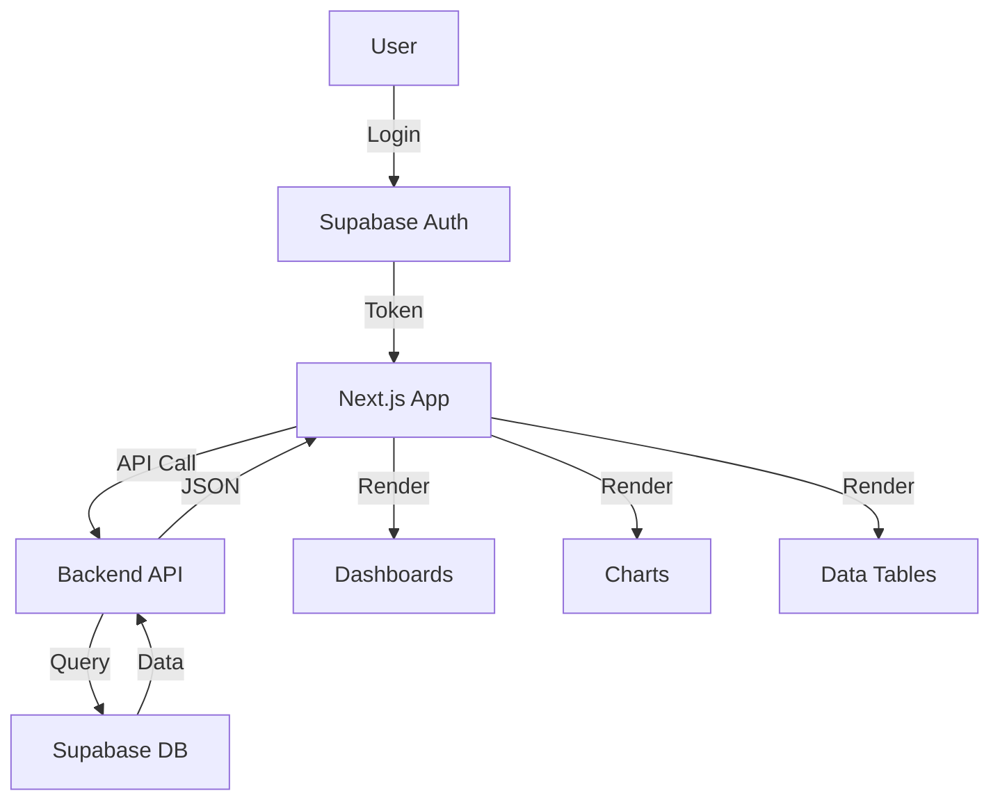

<div align="center">

<!-- 
  📸 MULTIMEDIA PLACEHOLDER - BANNER IMAGE
  ==========================================
  INSTRUCCIONES PARA CREAR EL BANNER:
  
  1. Dimensiones recomendadas: 1280x640px
  2. Debe incluir:
     - Nombre del proyecto: "SEDECyT Analytics Dashboard"
     - Tagline: "Real-Time Economic Data Visualization"
     - Captura de pantalla del dashboard (opcional)
     - Colores de marca (magenta, azul, modo oscuro)
  
  3. Herramientas recomendadas:
     - Canva (plantillas de GitHub banners)
     - Figma
     - Photoshop/GIMP
     
  4. Una vez creado, sube la imagen a:
     - Carpeta /docs/images/ del repositorio, o
     - Un servicio de hosting de imágenes
     
  5. Reemplaza la línea de abajo con:
     
-->
  
  
  <br/>
  
  <h1>🚀 SEDECyT Analytics - Frontend Dashboard</h1>
  
  <p>
    <strong>Modern, interactive dashboard that transforms economic data into actionable insights with real-time visualizations</strong>
  </p>
  
  <!-- BADGES -->
  <a href="https://github.com/enyeel/sedecyt_analytics_frontend">
    
  </a>
  
  
  
  
</div>

---

## 💡 El Problema

Currently, SEDECyT's process for generating key economic reports is **manual, slow, and error-prone**:

* 📝 **Manual Data Entry:** Data is consolidated by hand from various sources (Google Forms, spreadsheets, etc.) into a central Excel file
* 📊 **Static Reports:** This data is then manually transferred to PowerPoint presentations for analysis
* ⏰ **Inefficiency:** This workflow consumes **dozens of hours per month**, increases the risk of human error, and makes **real-time data analysis impossible**

**The Cost:** Decision-makers receive outdated information in static formats, making it impossible to explore data interactively or answer questions on-demand.

---

## 🛠️ La Solución

This frontend provides a **modern, interactive dashboard** that transforms how SEDECyT staff interact with economic data:

1. **🔐 Secure Access:** Login with Supabase Auth - no more shared spreadsheets
2. **📊 Interactive Dashboards:** Browse multiple dashboards with pre-calculated, real-time charts
3. **📈 Dynamic Visualizations:** Bar charts, pie charts, and line charts that update automatically
4. **🔍 Data Exploration:** Comprehensive table views to inspect underlying data
5. **📱 Responsive Design:** Works perfectly on desktop, tablet, and mobile devices

**The Result:** Instead of waiting days for a static PowerPoint, staff can **explore data in real-time**, drill down into specific metrics, and export insights instantly.

---

## 📺 Demo / Preview

<!-- 
  📸 MULTIMEDIA PLACEHOLDER - DEMO GIF/SCREENSHOTS
  =================================================
  INSTRUCCIONES PARA CREAR EL DEMO:
  
  OPCIÓN 1: GIF Animado (MUY RECOMENDADO)
  ---------------------------------------
  1. Herramientas:
     - ScreenToGif (Windows)
     - LICEcap (Mac/Windows)
     - OBS Studio + conversor a GIF
     
  2. Contenido a mostrar (en este orden):
     a) Login screen → ingresar credenciales
     b) Dashboard home grid → mostrar los 3 dashboards
     c) Click en un dashboard → transición suave
     d) Mostrar gráficos interactivos (hover, zoom si aplica)
     e) Abrir drawer de tablas → mostrar datos
     f) Exportar un gráfico a PDF
     
  3. Duración: 20-40 segundos (loop infinito)
  4. Dimensiones: 1200-1600px de ancho (ancho completo)
  5. Sube a: /docs/images/demo-dashboard.gif
     
  OPCIÓN 2: Screenshots en Grid (Alternativa)
  --------------------------------------------
  1. Capturas a incluir (4-6 imágenes):
     - Login screen
     - Dashboard home (grid view)
     - Dashboard detail con gráficos
     - Data table drawer abierto
     - Chart export modal
     - Mobile responsive view
     
  2. Crea un grid profesional con:
     - Canva (templates de portfolio)
     - Figma (diseño custom)
     - CSS Grid en HTML (si tienes hosting)
     
  3. Estilo: Modo oscuro, con bordes sutiles
  4. Sube a: /docs/images/dashboard-screenshots.png
     
  REEMPLAZA ESTA SECCIÓN CON:
  
  
  O para screenshots:
  <div align="center">
    
  </div>
-->

<div align="center">
  <p><em>📸 Demo video/screenshots will be added here</em></p>
  <p><small>See instructions in the code comments above</small></p>
</div>

---

## ✨ Key Features

* ⚡ **Instant Loading:** Dashboards load instantly with pre-calculated data, zero wait time
* 📊 **Interactive Visualizations:** Bar, pie, and line charts with Chart.js - hover, zoom, and PDF export
* 🔍 **Data Exploration:** Comprehensive table views with search, sorting, and filters for deep analysis
* 📱 **Fully Responsive:** Works perfectly on desktop, tablet, and mobile - access from any device
* 🎨 **Dark Mode:** Modern interface with dark theme optimized for long analysis sessions
* 🔐 **Secure:** Robust Supabase Auth authentication, secure sessions, JWT tokens
* 💾 **Smart Caching:** SWR automatically caches data, reducing API calls and improving performance
* 🚀 **Auto Deployment:** Complete CI/CD with GitHub Actions - push to main and it deploys automatically

---

## 🏗️ Arquitectura

<!-- 
  📊 MULTIMEDIA PLACEHOLDER - DIAGRAMA DE ARQUITECTURA
  =====================================================
  INSTRUCCIONES PARA CREAR EL DIAGRAMA:
  
  OPCIÓN 1: Mermaid.js (Recomendado - se renderiza en GitHub)
  -----------------------------------------------------------
  Puedes usar este código Mermaid directamente:
  
  ```mermaid
  graph TB
    A[User] -->|Login| B[Supabase Auth]
    B -->|Token| C[Next.js App]
    C -->|API Call| D[Backend API]
    D -->|Query| E[Supabase DB]
    E -->|Data| D
    D -->|JSON| C
    C -->|Render| F[Dashboards]
    C -->|Render| G[Charts]
    C -->|Render| H[Data Tables]
  ```
  
  OPCIÓN 2: Imagen Externa
  ------------------------
  1. Herramientas:
     - Draw.io (diagrams.net)
     - Lucidchart
     - Figma
     
  2. Elementos a incluir:
     - Usuario
     - Supabase Auth
     - Next.js Frontend
     - Backend API
     - Supabase Database
     - Componentes (Dashboards, Charts, Tables)
     
  3. Estilo: Moderno, con colores de marca
  4. Sube a: /docs/images/frontend-architecture.png
     
  REEMPLAZA ESTA SECCIÓN CON EL DIAGRAMA
-->



**Flujo de Usuario:**
1. **Login:** Usuario se autentica con Supabase
2. **Home:** Ve grid de dashboards disponibles
3. **Detail:** Selecciona dashboard → ve gráficos interactivos
4. **Explore:** Abre drawer de tablas para datos crudos
5. **Export:** Descarga gráficos como PDF

---

## 🚀 Stack Tecnológico

     

**Core Technologies:**
* **Next.js 16** - React framework with App Router
* **React 19** - UI library
* **Chart.js** - Data visualization (via react-chartjs-2)
* **Supabase Auth** - Authentication and session management
* **SWR** - Data fetching with caching and revalidation
* **Firebase Hosting** - Static site hosting
* **CSS Modules** - Scoped styling with dark mode support
* **jsPDF** - PDF export functionality

---

## 📚 Documentación Técnica

### Estructura del Proyecto

```
app/
├── components/
│   ├── AppHeader.js          # Top navigation
│   ├── ChartCard.js          # Chart renderer with PDF export
│   ├── DashboardDetail.js    # Detailed dashboard view
│   ├── DashboardHome.js     # Dashboard grid
│   ├── DataDrawer.js        # Bottom drawer for tables
│   ├── DataTable.js         # Interactive data table
│   ├── ErrorBoundary.js     # Error handling
│   ├── LoginForm.js         # Authentication
│   ├── Sidebar.js           # Navigation sidebar
│   └── SkeletonLoader.js    # Loading states
├── lib/
│   └── supabaseClient.js    # Supabase configuration
├── globals.css              # Global styles & theme
├── layout.js                # Root layout
└── page.js                  # Main orchestrator
```

### Features Detalladas

**Dashboard Views:**
* **Home Grid:** Responsive card layout showing all available dashboards
* **Detail View:** Deep dive into specific dashboard with multiple interactive charts
* **Sidebar Navigation:** Quick switching between dashboards without returning home

**Data Exploration:**
* **Data Table Drawer:** Bottom drawer that slides up to reveal comprehensive data tables
* **Three Data Views:**
  * Companies: Complete company information with formatted columns
  * Contacts: Contact details with cleaned phone numbers and emails
  * Responses: Full historical response data with certification tracking
* **Interactive Tables:** Sortable columns, search functionality, modal views for long text

**Chart Features:**
* Multiple chart types: Bar, Pie, Line
* Export to PDF: Download any chart as PDF document
* Responsive: Charts adapt to screen sizes
* Dark mode: Optimized color palette for dark theme

### API Integration

The frontend communicates with the backend API using authenticated requests:

**Endpoints Used:**
* `GET /api/dashboards` - List of all dashboards
* `GET /api/dashboards/<slug>` - Complete dashboard with charts
* `GET /api/data/companies-view` - Companies table data
* `GET /api/data/contacts-view` - Contacts table data
* `GET /api/data/responses-view` - Responses table data

**Authentication:**
* All requests include `Authorization: Bearer <token>` header
* Tokens are obtained from Supabase Auth session
* Automatic token refresh and session handling

**Data Fetching:**
* Uses SWR for intelligent caching and revalidation
* Deduplication of requests
* Optimistic UI updates
* Error handling with retry logic

---

## 🚀 Quick Start

For detailed installation instructions, see [INSTALL.md](./INSTALL.md).

**TL;DR:**
```bash
# Clone and setup
git clone https://github.com/enyeel/sedecyt_analytics_frontend.git
cd sedecyt_analytics_frontend

# Install dependencies
npm install

# Configure environment
cp .env.example .env.local  # Edit with your credentials

# Run development server
npm run dev
```

Visit http://localhost:3000

---

## 🔗 Integración con Backend

This frontend is designed to work seamlessly with the [SEDECyT Analytics Backend](https://github.com/enyeel/sedecyt_analytics_backend):

* **Authentication:** Both use Supabase Auth for unified user sessions
* **API Communication:** Frontend consumes backend API with authenticated requests
* **Data Flow:** Backend ETL → Supabase → Analytics → API → Frontend Charts
* **Environment Variables:**
  - `NEXT_PUBLIC_API_URL` points to backend instance
  - `NEXT_PUBLIC_SUPABASE_URL` and `NEXT_PUBLIC_SUPABASE_ANON_KEY` for auth

**CORS Configuration:**
The backend must allow requests from the frontend domain. Configure `FRONTEND_URL` in backend `.env`.

---

## 🚀 Deployment

Deployment is **fully automated** via GitHub Actions.

**Required Secrets:**
* `NEXT_PUBLIC_SUPABASE_URL`
* `NEXT_PUBLIC_SUPABASE_ANON_KEY`
* `NEXT_PUBLIC_API_URL`
* `FIREBASE_SERVICE_ACCOUNT_SEDECYT_ANALYTICS`

**Process:**
1. Push to `main` branch
2. GitHub Actions builds the static site
3. Deploys to Firebase Hosting
4. Site goes live automatically

See `.github/workflows/firebase-hosting-merge.yml` for details.

---

## 👥 Collaborators

* **[Ángel](https://github.com/enyeel)** — Data processing, backend architecture & overall project design  
* **[Emilio](https://github.com/AngelGTZ28)** — API & infrastructure development (Google Cloud, Supabase integration)  
* **[Yara](https://github.com/Yara09-L)** — Frontend development & UI integration  

> _This project is part of the university internship program at SEDECYT Aguascalientes._

---

## 🤝 Contact

Interested in implementing a similar solution for your organization?

* 📧 **Email:** [anjel.hdz22@gmail.com](mailto:anjel.hdz22@gmail.com)
* 💼 **LinkedIn:** [Your LinkedIn Profile]
* 🌐 **Portfolio:** [Your Portfolio Website]

---

## 🔮 Roadmap

* ⏳ Optimize chart colors for automatic dark mode detection (HSL adjustments)
* ⏳ Advanced filtering and search in data tables
* ⏳ Data export functionality (CSV/Excel) from table views
* ⏳ Dashboard customization options (user preferences)
* ⏳ Enhanced chart interactivity (drill-down, tooltips)
* ⏳ Real-time data updates via WebSockets or polling
* ⏳ Comprehensive analytics tracking
* ⏳ Accessibility improvements (ARIA labels, keyboard navigation)
